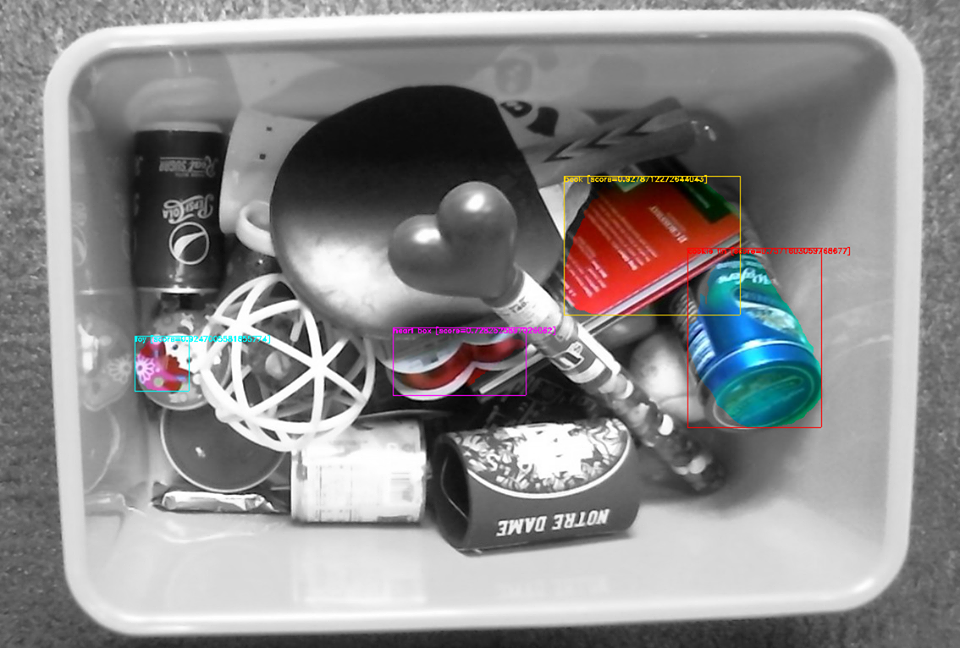
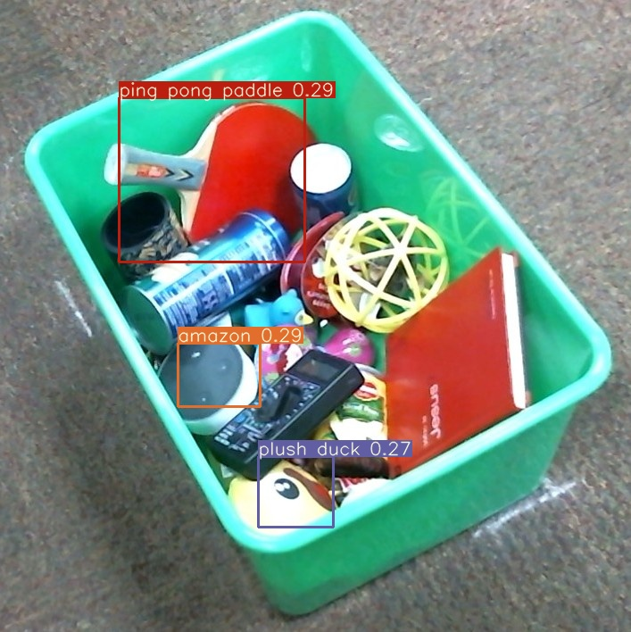
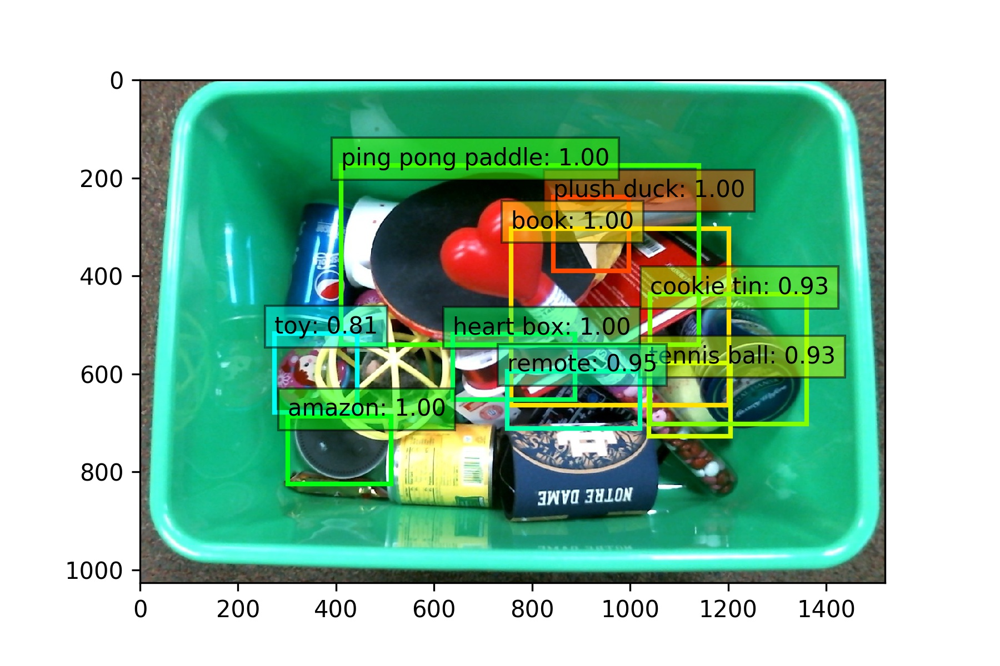
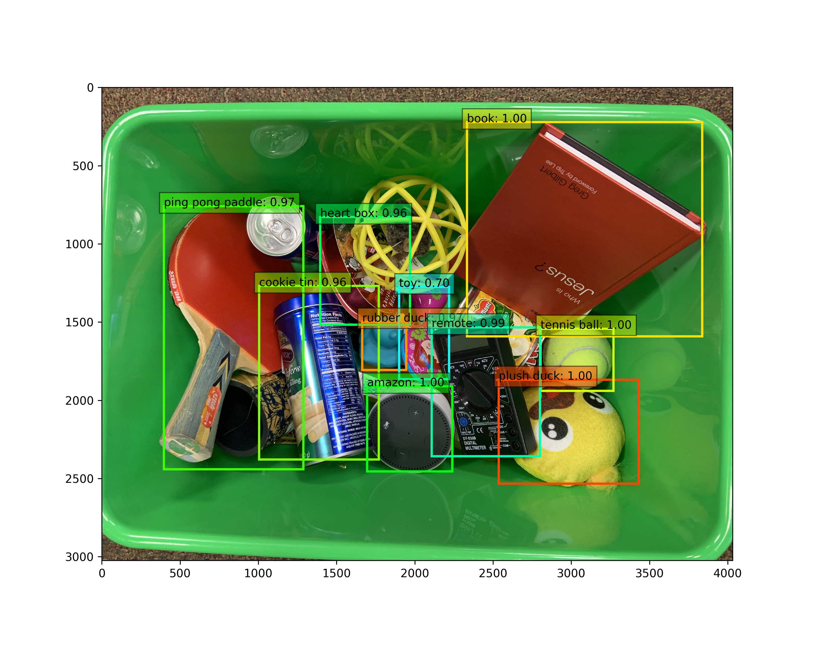

Detecting Objects in a Dense Clutter 
=========================================
# 1. A report (as a "readme")
Report has been included as a pdf file in the repository here

Google drive for images and weights: https://drive.google.com/drive/folders/1O4ad1TXfSJZaml829rID7T84JjUvs4IM?usp=sharing
# 2. Current version of programs with instructions on how to run them: 
## Mask-RCNN Usage: 
Download the project
  
     git clone https://github.com/Ying2019F/CVII_SemesterProject.git

Navigate to the cluster directory 

    cd Mask_RCNN/samples/cluster/
    
For Predicting on a new image: 
Use 'Python3.7' and download requirements from requirements.txt

Weights and images included in google drive :) 

Easiest way would be to use the jupyter notebook in cluster! 

Example usage:

    python3.7 samples/cluster/cluster.py splash --weights='mask_rcnn_object_0099.h5' --image='LAYOUT2_PL2_WEBCAM_TOP_Photo_on_1-27-20_at_3.06_PM.jpg'

Sample running on test image: 

  

Sample running on validation image: 

  

## YOLO Usage: 
Navigate to the cluster directory 

    cd Yolov3

**Requirements**: 
Use Python 3.7, requirements.txt file includes all the packages required.

Weights and data are in google drive.
Data folder has data for all 3 cases - 
 - training on mobile images, testing on webcam images (Sensor1vsSensor2)
 - training on layout 1 images, testing on layout 2 images (Layout1vsLayout2)
 - training on top angle images, testing on side angle images (TopvsSide)

 unzip these folders and move the train.txt file, val.txt file, images folder to the data folder.

**Training**:

    python3 train.py --cfg cfg/yolov3.cfg --data data/yolo.data --weights weights/best_mobile_500.pt

training requires the training images in path /data/images/.. and train.txt and val.txt in path /data/..

**Testing**:

    python3 detect.py --weights weights/best_mobile_500.pt --source data/test_webcam_images

**Validation Testing**:

    python3 detect.py --weights weights/best_mobile_500.pt --source data/validation

Sample running on test image: 

  

Sample running on validation image: 

  

## SSD Usage: 

### A webcam tote image was detected

  

### An Iphone tote image was detected

  

### Requirements
For training
python/2.7.15 cuda/10.0 cudnn/7.4 opencv/3.4 intel/19.0 tcl/8.6.8 gcc/8.3.0 hdf5/1.8.20-gcc mkl

For detection
caffe version: 1.0.0-rc3

Input datasets and trained models are available on this google drive link: https://drive.google.com/drive/folders/1O4ad1TXfSJZaml829rID7T84JjUvs4IM?usp=sharing

### Install Caffe
Dependencies for installing Caffe are listed here https://caffe.berkeleyvision.org/installation.html#prerequisites
Details can be found on https://github.com/weiliu89/caffe

### Train SSD

Follow the Pascal VOC dataset format to prepare the input dataset (available here https://drive.google.com/drive/folders/1O4ad1TXfSJZaml829rID7T84JjUvs4IM?usp=sharing).

### Generate LMDB file

1. Run create_list.sh to generate test_name_size.txt, test.txt, and trainval.txt in data/amazon/
2. Modify labelmap_amazon.prototxt 
3. Run create_data.sh to create LMDB database and make a soft link in examples/amazon/

### Training and evaluation

1. python ssd_pascal_orig.py to train the model
2. python score_ssd_pascal.py to evaluate the model

### Visualization

To run ssd_amazon_detect.ipynb to do the detection on a single tote image

# 4. For Groups: 
  * Mask-RCNN: Sophia Abraham 
  * YOLO: Bhakti Sharma 
  * SSD: Ying Qiu 
